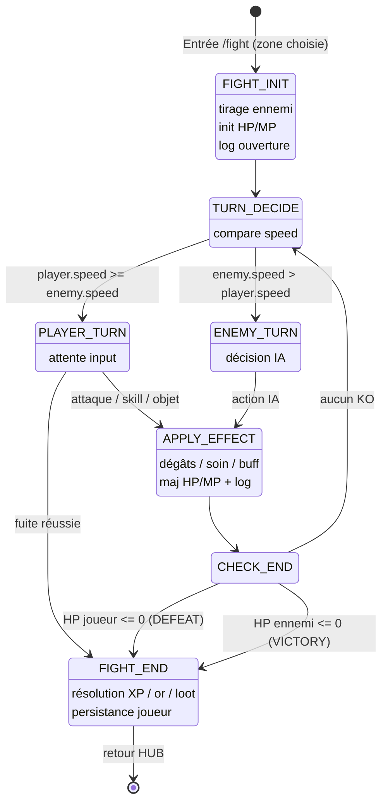
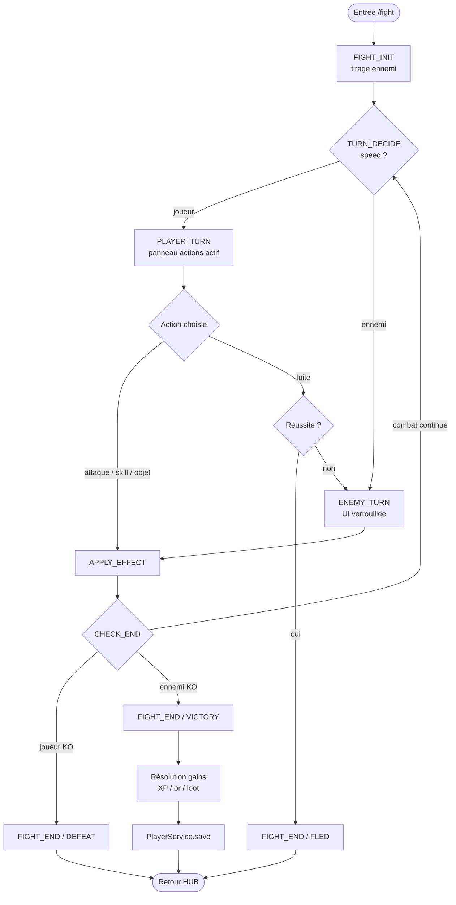
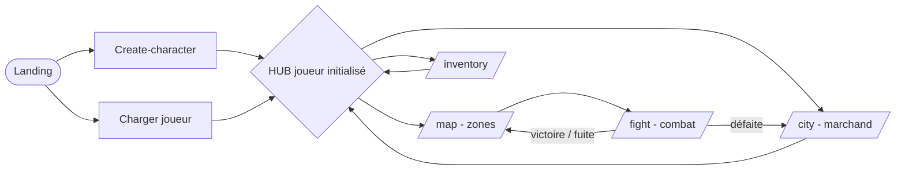

# Description de la boucle de gameplay

## Prérequis

## Description

### Boucle de combat — vue états

```mermaid
stateDiagram-v2
    [*] --> FIGHT_INIT: Entrée /fight (zone choisie)

    FIGHT_INIT: FIGHT_INIT
    FIGHT_INIT: tirage ennemi
    FIGHT_INIT: init HP/MP
    FIGHT_INIT: log ouverture
    FIGHT_INIT --> TURN_DECIDE

    TURN_DECIDE: TURN_DECIDE
    TURN_DECIDE: compare speed
    TURN_DECIDE --> PLAYER_TURN: player.speed >= enemy.speed
    TURN_DECIDE --> ENEMY_TURN: enemy.speed > player.speed

    PLAYER_TURN: PLAYER_TURN
    PLAYER_TURN: attente input
    PLAYER_TURN --> APPLY_EFFECT: attaque / skill / objet
    PLAYER_TURN --> FIGHT_END: fuite réussie

    ENEMY_TURN: ENEMY_TURN
    ENEMY_TURN: décision IA
    ENEMY_TURN --> APPLY_EFFECT: action IA

    APPLY_EFFECT: APPLY_EFFECT
    APPLY_EFFECT: dégâts / soin / buff
    APPLY_EFFECT: maj HP/MP + log
    APPLY_EFFECT --> CHECK_END

    CHECK_END --> TURN_DECIDE: aucun KO
    CHECK_END --> FIGHT_END: HP joueur <= 0 (DEFEAT)
    CHECK_END --> FIGHT_END: HP ennemi <= 0 (VICTORY)

    FIGHT_END: FIGHT_END
    FIGHT_END: résolution XP / or / loot
    FIGHT_END: persistance joueur
    FIGHT_END --> [*]: retour HUB
```

### Boucle de combat — flow décisionnel

```mermaid
flowchart TD
    A([Entrée /fight]) --> B[FIGHT_INIT<br/>tirage ennemi]
    B --> C{TURN_DECIDE<br/>speed ?}
    C -->|joueur| D[PLAYER_TURN<br/>panneau actions actif]
    C -->|ennemi| E[ENEMY_TURN<br/>UI verrouillée]
    D --> F{Action choisie}
    F -->|attaque / skill / objet| G[APPLY_EFFECT]
    F -->|fuite| H{Réussite ?}
    H -->|oui| K[FIGHT_END / FLED]
    H -->|non| E
    E --> G
    G --> I{CHECK_END}
    I -->|combat continue| C
    I -->|joueur KO| J[FIGHT_END / DEFEAT]
    I -->|ennemi KO| L[FIGHT_END / VICTORY]
    J --> M([Retour HUB])
    K --> M
    L --> N[Résolution gains<br/>XP / or / loot]
    N --> O[PlayerService.save]
    O --> M
```

### Macro-boucle de l'application

```mermaid
flowchart LR
    Landing([Landing]) --> Create[Create-character]
    Landing --> Load[Charger joueur]
    Create --> Hub
    Load --> Hub
    Hub{HUB joueur initialisé} --> Map[/map - zones/]
    Hub --> City[/city - marchand/]
    Hub --> Inv[/inventory/]
    Map --> Fight[/fight - combat/]
    Fight -->|victoire / fuite| Map
    Fight -->|défaite| City
    City --> Hub
    Inv --> Hub
```
